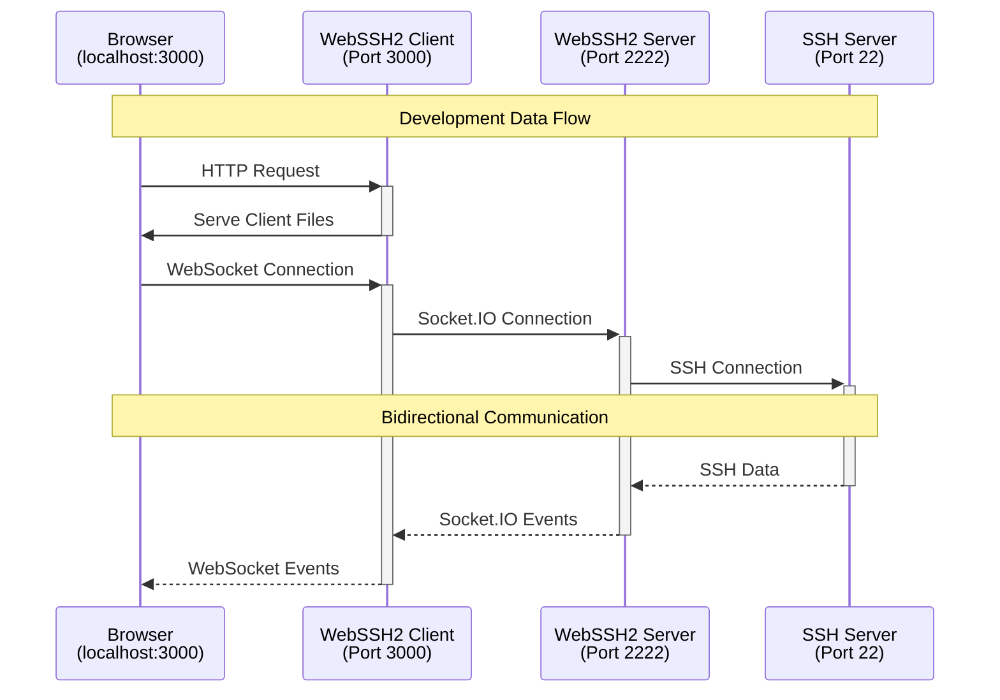

# WebSSH2 Development Guide

This guide explains how to set up and run the WebSSH2 client and server components for development.

## Prerequisites

- Node.js 22+
- npm
- Git
- Two terminal windows/sessions

## Project Setup

1. Create a development directory and clone both repositories:

```bash
mkdir webssh2-dev
cd webssh2-dev

# Clone the client repository
git clone https://github.com/billchurch/webssh2_client.git

# Clone the server repository
git clone https://github.com/billchurch/webssh2.git webssh2_server
```

2. Install dependencies for both projects:

```bash
# Install client dependencies
cd webssh2_client
npm install

# Install server dependencies
cd ../webssh2_server
npm install
```

## Development Workflow

### Starting the Server Component

1. In your first terminal window, navigate to the server directory:

```bash
cd webssh2_server
```

2. Start the server in development mode:

```bash
npm run watch
```

This will:

- Start the WebSSH2 server on port `2222`
- Enable automatic reloading when server files change
- Allow CORS for the development client

### Starting the Client Component

1. In your second terminal window, navigate to the client directory:

```bash
cd webssh2_client
```

2. Start the client in development mode:

```bash
npm run dev
```

This will:

- Start the Vite dev server on port `3000` with live reload
- Proxy `/ssh/socket.io` to `http://localhost:2222` (see `client/src/vite.config.js`)
- Expose a banner define for version/build stamp

### Accessing the Development Environment

1. Open your web browser and navigate to:

```
http://localhost:3000
```

2. The client will automatically connect to the development server at `localhost:2222`

## Development Architecture



## File Watching and Auto-Reload

Both client and server components support file watching and automatic reloading:

- Client changes trigger Vite HMR and automatic rebuild
- Server changes trigger watch mode (nodemon / equivalent) to restart

## Important Notes

1. The server and client components must use Socket.IO v2.2.0 for compatibility
2. Client dev server (3000) and WebSSH2 server (2222) must run simultaneously
3. CORS/proxy is handled by Vite in development (see `server.proxy` in `vite.config.js`)
4. No inline scripts are used; CSP is strict for scripts and allows inline styles for xterm

## Troubleshooting

If you encounter issues:

1. Ensure both servers are running (`npm run watch` in both directories)
2. Check the browser console for client-side errors
3. Check terminal output for server-side errors
4. Verify the ports (3000 and 2222) are available
5. Clear browser cache if changes aren't reflecting

## Building for Production

When ready to build for production:

```bash
cd webssh2_client
npm run build        # client bundle to client/public
npm run build:server # Node entrypoints to JS
```

Artifacts:

- Client: `client/public/{webssh2.bundle.js, webssh2.css, client.htm}`
- Node: root `index.js`, `client/index.js` (compiled from TypeScript)

## Type Checking and Linting

Run type checks and linting locally before PRs:

```bash
npm run typecheck         # root TS (server/entry files)
npm run typecheck:client  # client TS
npm run lint              # ESLint with security rules
```

Security-focused ESLint rules (see SECURITY.md) prevent unsanitized DOM sinks like `innerHTML` and inline script-like patterns.

## Manual Accessibility Checklist

Run these quick checks before merging UI changes. See ACCESSIBILITY.md for deeper guidance.

Tools

- HTML lint: `npm run lint:html`
- CSS lint: `npm run lint:css`
- Node a11y smoke: `node --test tests/a11y-terminal.test.js`
- Axe CLI (dev server must be running):
  - `npm run dev` in one terminal
  - `npm run a11y:axe` (or `npm run a11y:axe:bin`)
  - If permission denied: `chmod +x node_modules/.bin/axe`
  - If ChromeDriver missing: `npm i -g browser-driver-manager && npx browser-driver-manager install chrome`

Checklist

- Page structure
  - `<html lang>` set (e.g., `en`).
  - Landmarks present and logical headings (one `<h1>`).
  - Provide a skip link to main/terminal (nice to have).
- Forms (login, prompts)
  - Every input/textarea has a programmatic label (`<label for>` or `aria-labelledby`).
  - Required fields indicated; errors surface in the error dialog and are announced.
  - Useful `autocomplete` (e.g., `username`, `current-password`).
- Dialogs (error, prompt, settings)
  - Each has a clear heading; close buttons have `type="button"`.
  - Focus moves into dialog when opened; returns to invoker on close (verify manually).
- Keyboard and focus
  - All controls operable with keyboard; tab order is logical.
  - No positive `tabindex`; focus is visibly styled (use `:focus-visible`).
- Live region and updates
  - `#status` has `role="status"` and announces connect/disconnect/errors.
- Color and motion
  - Contrast: text 4.5:1; large text/UI 3:1.
  - Respect reduced motion; avoid excessive animation (cursor blink off is ideal with reduced motion).
- Terminal specifics
  - Terminal container is focusable and named (e.g., `aria-label="Terminal"`).
  - Do not stream terminal output into live regions; only announce discrete events.

Quick Runbook

1. Start dev server: `npm run dev`
2. Lint: `npm run lint:html && npm run lint:css`
3. Node test: `node --test tests/a11y-terminal.test.js`
4. Axe scan: `npm run a11y:axe`
