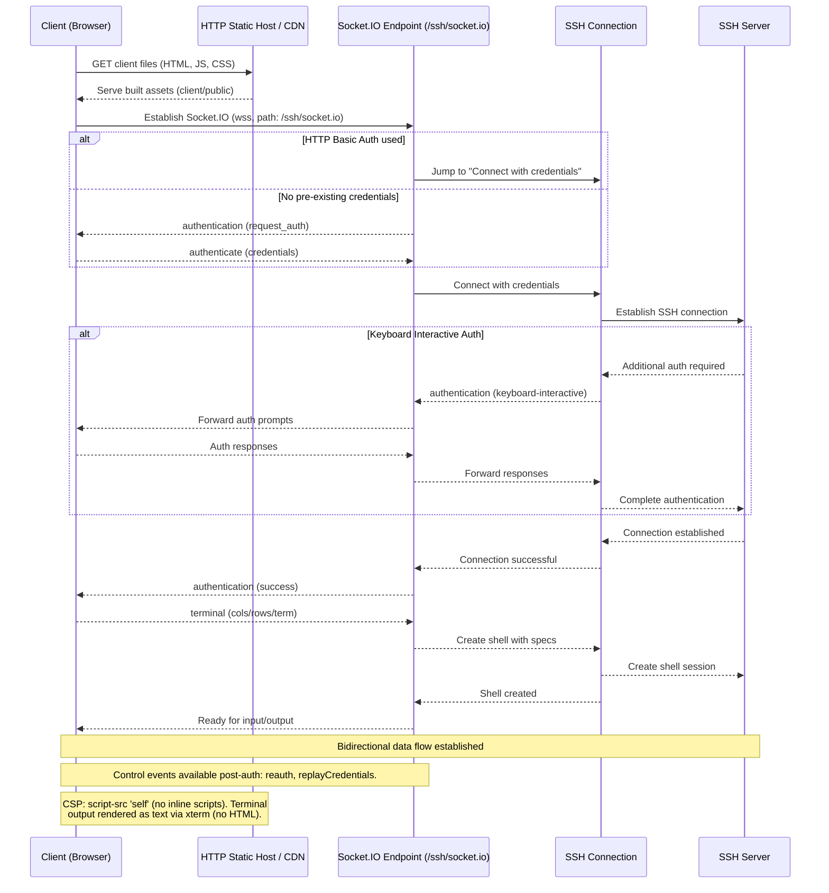
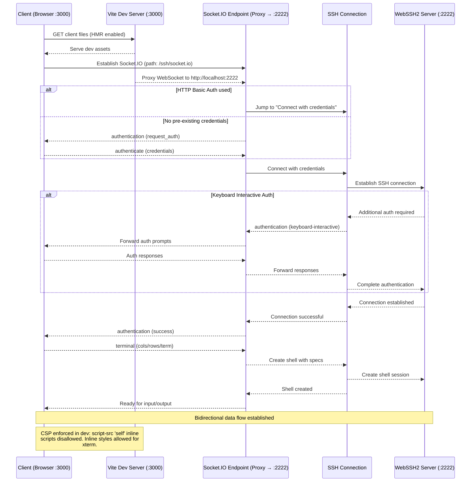

# Application Flow

## Production Flow

```mermaid
sequenceDiagram
    participant Browser as Client (Browser)
    participant CDN as HTTP Static Host / CDN
    participant IO as Socket.IO Endpoint (/ssh/socket.io)
    participant SSHConn as SSH Connection
    participant SSH as SSH Server

    Browser->>CDN: GET client files (HTML, JS, CSS)
    CDN-->>Browser: Serve built assets (client/public)

    Browser->>IO: Establish Socket.IO (wss, path: /ssh/socket.io)
    alt HTTP Basic Auth used
        IO->>SSHConn: Jump to "Connect with credentials"
    else No pre-existing credentials
        IO-->>Browser: authentication (request_auth)
        Browser-->>IO: authenticate (credentials)
    end

    IO->>SSHConn: Connect with credentials
    SSHConn->>SSH: Establish SSH connection
    alt Keyboard Interactive Auth
        SSH-->>SSHConn: Additional auth required
        SSHConn-->>IO: authentication (keyboard-interactive)
        IO-->>Browser: Forward auth prompts
        Browser-->>IO: Auth responses
        IO-->>SSHConn: Forward responses
        SSHConn-->>SSH: Complete authentication
    end

    SSH-->>SSHConn: Connection established
    SSHConn-->>IO: Connection successful
    IO-->>Browser: authentication (success)
    Browser-->>IO: terminal (cols/rows/term)
    IO-->>SSHConn: Create shell with specs
    SSHConn-->>SSH: Create shell session
    SSHConn-->>IO: Shell created
    IO-->>Browser: Ready for input/output

    Note over Browser,SSH: Bidirectional data flow established

    Note over Browser,IO: Control events available post-auth: reauth, replayCredentials.
    Note over Browser,CDN: CSP: script-src 'self' (no inline scripts). Terminal<br> output rendered as text via xterm (no HTML).
```

## Development Flow

```mermaid
sequenceDiagram
    participant Browser as Client (Browser :3000)
    participant Vite as Vite Dev Server (:3000)
    participant IO as Socket.IO Endpoint (Proxy → :2222)
    participant SSHConn as SSH Connection
    participant SSH as WebSSH2 Server (:2222)

    Browser->>Vite: GET client files (HMR enabled)
    Vite-->>Browser: Serve dev assets

    Browser->>IO: Establish Socket.IO (path: /ssh/socket.io)
    Vite-->>IO: Proxy WebSocket to http://localhost:2222

    alt HTTP Basic Auth used
        IO->>SSHConn: Jump to "Connect with credentials"
    else No pre-existing credentials
        IO-->>Browser: authentication (request_auth)
        Browser-->>IO: authenticate (credentials)
    end

    IO->>SSHConn: Connect with credentials
    SSHConn->>SSH: Establish SSH connection
    alt Keyboard Interactive Auth
        SSH-->>SSHConn: Additional auth required
        SSHConn-->>IO: authentication (keyboard-interactive)
        IO-->>Browser: Forward auth prompts
        Browser-->>IO: Auth responses
        IO-->>SSHConn: Forward responses
        SSHConn-->>SSH: Complete authentication
    end

    SSH-->>SSHConn: Connection established
    SSHConn-->>IO: Connection successful
    IO-->>Browser: authentication (success)
    Browser-->>IO: terminal (cols/rows/term)
    IO-->>SSHConn: Create shell with specs
    SSHConn-->>SSH: Create shell session
    SSHConn-->>IO: Shell created
    IO-->>Browser: Ready for input/output
    Note over Browser,SSH: Bidirectional data flow established
    Note over Browser,Vite: CSP enforced in dev: script-src 'self' inline<br> scripts disallowed. Inline styles allowed for<br>xterm.

```
